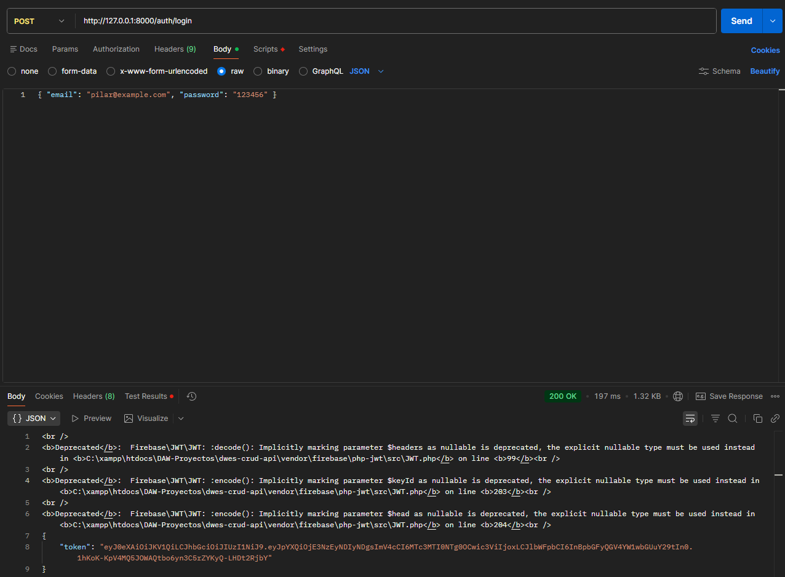
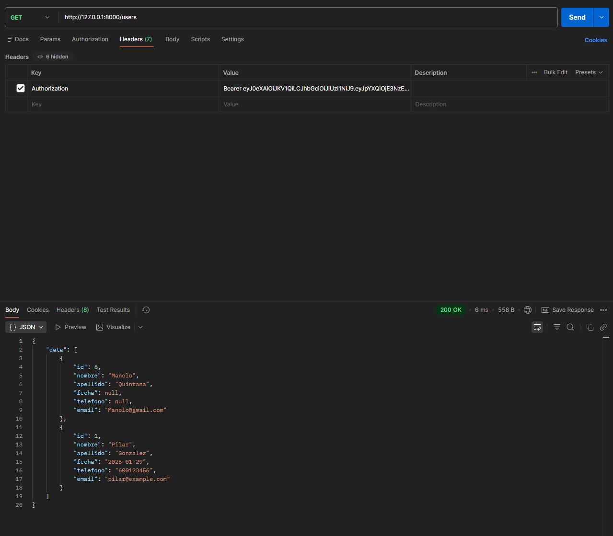
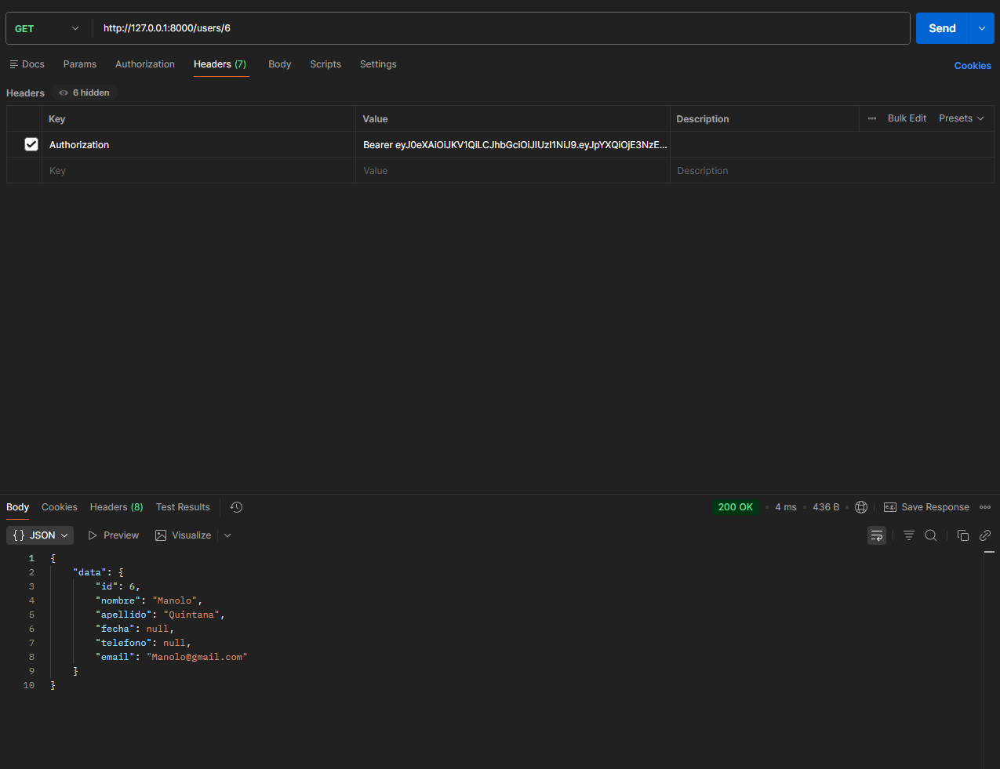
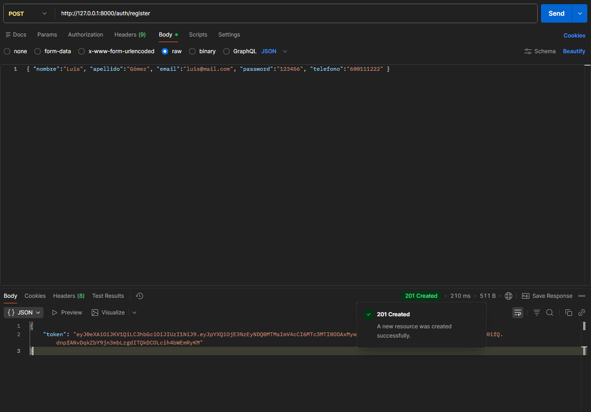
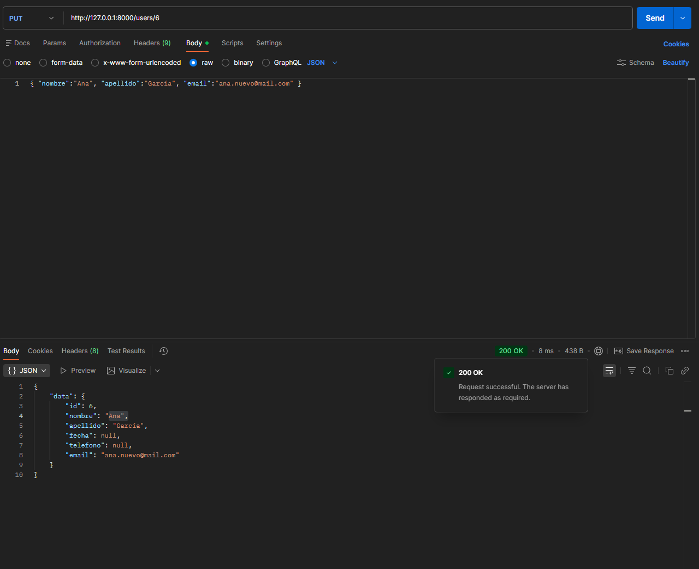
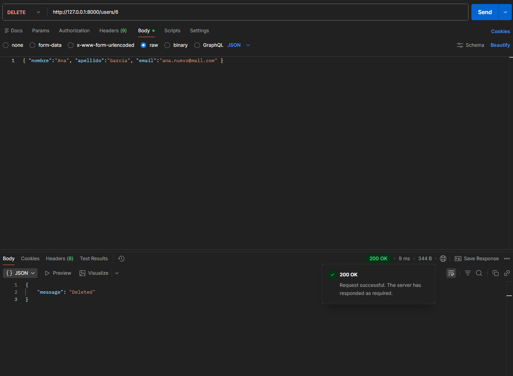
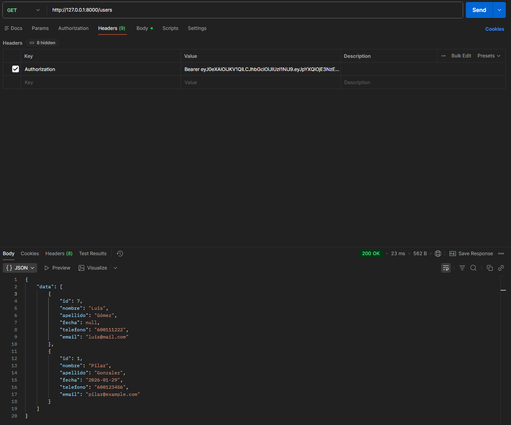

# CRUD API

Variables recomendadas en Postman:
-  copia la base de datos en /migrations a su base de datos
- `baseUrl` = `http://127.0.0.1:8000`
- `token` = (rellenar tras login)

1) Arrancar servidor (desde la carpeta `Crud-api`):

```powershell
php -S 127.0.0.1:8000 -t public
```

2) Obtener token (login)
- Método: `POST`
- URL: `{{baseUrl}}/auth/login`
- Body (JSON): `{ "email": "pilar@example.com", "password": "123456" }`
- Copia el valor `token` de la respuesta y pégalo en la variable de entorno `token`.



3) GET - Listar usuarios
- Método: `GET`
- URL: `{{baseUrl}}/users`
- Headers: `Authorization: Bearer {{token}}`



4) GET - Obtener usuario por id
- Método: `GET`
- URL: `{{baseUrl}}/users/:id` (ej: `{{baseUrl}}/users/3`)
- Headers: `Authorization: Bearer {{token}}`



5) POST - Crear usuario
- Método: `POST`
- URL: `{{baseUrl}}/users`
- Headers: `Authorization: Bearer {{token}}`, `Content-Type: application/json`
- Body (JSON ejemplo):
```json
{ "nombre":"Luis", "apellido":"Gómez", "email":"luis@mail.com", "password":"123456", "telefono":"600111222" }
```


6) PUT/PATCH - Actualizar usuario
- Método: `PUT` (reemplazo) o `PATCH` (parcial)
- URL: `{{baseUrl}}/users/:id`
- Headers: `Authorization: Bearer {{token}}`, `Content-Type: application/json`
- Body (JSON ejemplo): `{ "nombre":"Ana", "apellido":"García", "email":"ana.nuevo@mail.com" }`
EN el id 6 que se puede ver su contenido anteriormente arriba.


7) DELETE - Borrar usuario
- Método: `DELETE`
- URL: `{{baseUrl}}/users/:id`
- Headers: `Authorization: Bearer {{token}}`





---

Autor: ALberto Garcia Quintana (2º DAW)
